Coup is a leader in shared urban eScooters. On this assignment we will
analyse a subset of Coup dataset on user activities.

We have access to the following data:

[**Users:**](users.csv)

*Data of new users starting COUP signup process since July 1st in one of
our markets*

-   `user_id`: Unique user identifier
-   `signup_started`: Time (Berlin timezone) when user started COUP app
    signup process
-   `signup_completed`: Time (Berlin timezone) when user completed COUP
    app signup process
-   `acquisition_channel`: Acquisition channel of the user

[**Rentals:**](rentals.csv)

*COUP Scooter rental data since July 1st*

-   `rental_id`: Unique rental identifier
-   `rental_created_at`: Time (UTC) when new rental transaction was
    created
-   `rental_ended_at`: Time (UTC) when rental transaction was ended
-   `user_id`: Unique user identifier (user creating the rental)
-   `rental_end_event`: Rental can have four different end events:
    -   `Cancel`: Rental is cancelled by user
    -   `Expire`: Rental is expired. This happens when a user does not
        unlock the scooter within a certain time period from the time
        the rental was created
    -   `Remote_cancel`: Rental is cancelled by COUP customer service
    -   `Close`: Rental is ended by the user and is not cancelled nor
        expired. Only rentals with `end_event` `close` are considered
        `rides`.

[**Temperatures:**](temperatures.csv)

*Hourly temperature data of the given market*

-   `observation_time`: Time of the observed temperature
-   `temp_c`: Observed temperature (Celsius) at the given time

We will use these datasets to work on three specific tasks: [Cohort
Analysis](#cohort), [SignUp Durations](#durations), and [Temperature
effect on Rides](#temprides).

Data Import and Wrangling
============================================

First we import the relevant packages and upload our data in R:

    if (!require(tidyverse)) install.packages("tidyverse")
    library(tidyverse)

    if (!require(lubridate)) install.packages("lubridate")
    library(lubridate)

    if (!require(plotly)) install.packages("plotly")
    library(plotly)

    data.users   <- read_delim("users.csv", ";", col_names = T, escape_double = FALSE, trim_ws = TRUE)
    data.rentals <- read_delim("rentals.csv", ";", col_names = T, escape_double = FALSE, trim_ws = TRUE)
    data.temper  <- read_delim("temperatures.csv", ",", col_names = T, escape_double = FALSE, trim_ws = TRUE)

Then we change the class of non numeric/datetime data to factor:

    data.users$acquisition_channel <- as.factor(data.users$acquisition_channel)
    data.rentals$rental_end_event <- as.factor(data.rentals$rental_end_event)

We only need to change `data.users$acquisition_channel` and
`data.rentals$rental_end_event`. We cannot factor the `user_id` columns
as the factor will be different between `users` and `rentals` (it is
possible to deal with it while joining table with `dplyr`, however it is
simpler to keep it as character strings). All dates are in the `POSIXct`
format.

We know from the data description that the Time Zone between users and
rentals are different, we make it similar:

    data.rentals$rental_created_at <- with_tz(ymd_hms(data.rentals$rental_created_at, tz = "UTC"), "Europe/Berlin")
    data.rentals$rental_ended_at <- with_tz(ymd_hms(data.rentals$rental_ended_at, tz = "UTC"), "Europe/Berlin")

The data description tells us that dates in users are in "CEST", let's
check:

    print(attr(data.users$signup_started,"tzone"))

    ## [1] "UTC"

    print(attr(data.users$signup_completed,"tzone"))

    ## [1] "UTC"

We set the date as "CEST":

    data.users$signup_started <- force_tz(data.users$signup_started, "Europe/Berlin")
    data.users$signup_completed <- force_tz(data.users$signup_completed, "Europe/Berlin")

Check the data:

    summary(data.users)

    ##    user_id          signup_started               
    ##  Length:6239        Min.   :2018-07-01 00:06:34  
    ##  Class :character   1st Qu.:2018-07-11 18:57:07  
    ##  Mode  :character   Median :2018-07-24 17:27:55  
    ##                     Mean   :2018-07-27 12:39:19  
    ##                     3rd Qu.:2018-08-10 19:06:10  
    ##                     Max.   :2018-09-03 15:33:20  
    ##                     NA's   :2                    
    ##  signup_completed                        acquisition_channel
    ##  Min.   :2018-07-01 07:47:40   Organic             :4189    
    ##  1st Qu.:2018-07-14 11:52:57   Referral            : 529    
    ##  Median :2018-07-27 18:39:48   Instagram Installs  : 333    
    ##  Mean   :2018-07-29 22:18:31   Facebook Installs   : 332    
    ##  3rd Qu.:2018-08-13 21:19:45   Adwords UAC Installs: 212    
    ##  Max.   :2018-09-03 17:45:17   (Other)             : 643    
    ##  NA's   :1                     NA's                :   1

    summary(data.rentals)

    ##   rental_id         rental_created_at            
    ##  Length:296732      Min.   :2018-07-01 02:00:07  
    ##  Class :character   1st Qu.:2018-07-15 06:24:30  
    ##  Mode  :character   Median :2018-07-30 10:42:09  
    ##                     Mean   :2018-08-01 04:02:32  
    ##                     3rd Qu.:2018-08-18 20:34:16  
    ##                     Max.   :2018-09-03 21:04:41  
    ##                                                  
    ##  rental_ended_at                 user_id               rental_end_event 
    ##  Min.   :2018-07-01 02:01:34   Length:296732      cancel       : 99261  
    ##  1st Qu.:2018-07-15 04:32:54   Class :character   close        :165948  
    ##  Median :2018-07-30 04:10:59   Mode  :character   expire       : 26140  
    ##  Mean   :2018-08-01 03:16:02                      remote_cancel:  5044  
    ##  3rd Qu.:2018-08-18 21:09:46                      NA's         :   339  
    ##  Max.   :2018-09-03 21:05:30                                            
    ##  NA's   :1146

    summary(data.temper)

    ##  observation_time                  temp_c     
    ##  Min.   :2018-07-01 00:00:35   Min.   :13.70  
    ##  1st Qu.:2018-07-17 05:40:03   1st Qu.:20.10  
    ##  Median :2018-08-02 12:25:04   Median :22.90  
    ##  Mean   :2018-08-02 10:29:18   Mean   :23.34  
    ##  3rd Qu.:2018-08-18 15:10:06   3rd Qu.:26.30  
    ##  Max.   :2018-09-03 17:55:11   Max.   :36.20  
    ##                                NA's   :11

We have few `NA` values in each dataset. We only take the complete
cases:

    data.users <- data.users[complete.cases(data.users), ]
    data.rentals <- data.rentals[complete.cases(data.rentals), ]
    data.temper <- data.temper[complete.cases(data.temper), ]

Looking at summary from the various dataset it doesn't look like we have
any values/date out of range. We are now ready to analyse the data.

Cohort Analysis
==================================

We will calculate weekly retention rates based on the rides new users
have been making. We define cohort based on the week the signup process
started, that is, we have one new cohort per week.

We first need to assign a week number to each user according to the date
of the signup process:

    data.users <- data.users %>%
      mutate(week_cohort = isoweek(signup_started))

As we don't have data covering multiple years, the week number is
enough.

We, similarly, assign a week number per ride:

    data.rentals <- data.rentals %>%
      mutate(week_ride = isoweek(rental_created_at))

We now add in the rentals dataset the `week_cohort` of the user who made
the ride:

    data.rentals <- left_join(data.rentals,select(data.users, user_id, week_cohort), by = "user_id")
    summary(data.rentals$week_cohort)

    ##    Min. 1st Qu.  Median    Mean 3rd Qu.    Max.    NA's 
    ##   26.00   27.00   29.00   29.26   31.00   36.00  224622

We have a lot of `NA` values in the new `week_cohort` of `data.rentals`,
this is because we have only the users data for new Coup users (from
1st of July), while the rentals include data of all rentals
made, including the ones by users who installed the app before July
2018. From the summary we can see that 224,622 out of the 296,014
rentals (including aborted ones) from the 1st of July to the
3rd of September were made by non-new users, this represents
around 76%. We will then be able to use only 24% of our rentals dataset
for cohort analysis.

Let's see how much users we have per cohort:

    cohort.numUsers <- data.users %>%
      group_by(week_cohort) %>% summarise(num_users = n())

    p <- cohort.numUsers %>%
      ggplot(aes(x = as.factor(week_cohort), y = num_users, fill = as.factor(week_cohort))) +
          geom_bar(stat = "identity") +
          xlab("week of cohort") + ylab("number of users per cohort") +
          ggtitle("Number of users per cohort") +
          guides(fill=FALSE)
    print(p)

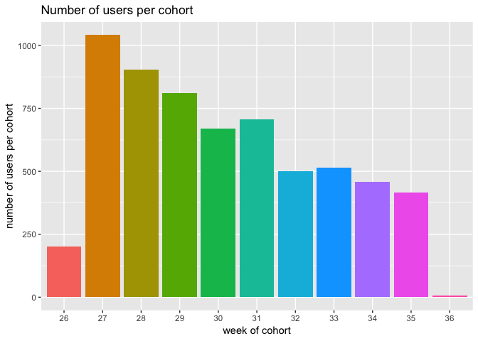

By the definition we took, new weeks starts on Monday. The week 26 of
2018 ended on Sunday 1st of July. Monday 2nd of
July is part of week 27. So our first cohort, for week 26, is incomplete
as it has only the users who installed the Coup app on Sunday
1st of July 2018. Same for week 36. Our data end on the
3rd of September, at approximately 9pm, and the week 36
started on that day. So for week 36 we have only an incomplete day of
data. We will drop these two cohorts from our analysis as they are
incomplete.

We create now a dataframe where the columns are the cohorts and rows are
the week we're at, the values being the number of successful rentals
made:

    cohort.df <- na.omit(data.rentals) %>% 
      filter(rental_end_event == "close") %>%
      group_by(week_cohort,week_ride) %>%
      summarise(num_rides = n()) %>%
      filter(week_ride < 36 & week_cohort < 36 & week_ride > 26 & week_cohort > 26)

    cohort.df2 <- spread(cohort.df, week_cohort, num_rides)

    cohort.df$week_cohort <- as.factor(cohort.df$week_cohort)
    cohort.df$week_ride <- as.factor(cohort.df$week_ride)

    knitr::kable(cohort.df2, caption = "Successful weekly ride per week per cohort")

<table>
<caption>Successful weekly ride per week per cohort</caption>
<thead>
<tr class="header">
<th align="right">week_ride</th>
<th align="right">27</th>
<th align="right">28</th>
<th align="right">29</th>
<th align="right">30</th>
<th align="right">31</th>
<th align="right">32</th>
<th align="right">33</th>
<th align="right">34</th>
<th align="right">35</th>
</tr>
</thead>
<tbody>
<tr class="odd">
<td align="right">27</td>
<td align="right">1217</td>
<td align="right">NA</td>
<td align="right">NA</td>
<td align="right">NA</td>
<td align="right">NA</td>
<td align="right">NA</td>
<td align="right">NA</td>
<td align="right">NA</td>
<td align="right">NA</td>
</tr>
<tr class="even">
<td align="right">28</td>
<td align="right">1415</td>
<td align="right">857</td>
<td align="right">NA</td>
<td align="right">NA</td>
<td align="right">NA</td>
<td align="right">NA</td>
<td align="right">NA</td>
<td align="right">NA</td>
<td align="right">NA</td>
</tr>
<tr class="odd">
<td align="right">29</td>
<td align="right">1147</td>
<td align="right">1136</td>
<td align="right">940</td>
<td align="right">NA</td>
<td align="right">NA</td>
<td align="right">NA</td>
<td align="right">NA</td>
<td align="right">NA</td>
<td align="right">NA</td>
</tr>
<tr class="even">
<td align="right">30</td>
<td align="right">918</td>
<td align="right">961</td>
<td align="right">1146</td>
<td align="right">703</td>
<td align="right">NA</td>
<td align="right">NA</td>
<td align="right">NA</td>
<td align="right">NA</td>
<td align="right">NA</td>
</tr>
<tr class="odd">
<td align="right">31</td>
<td align="right">915</td>
<td align="right">887</td>
<td align="right">1061</td>
<td align="right">862</td>
<td align="right">1029</td>
<td align="right">NA</td>
<td align="right">NA</td>
<td align="right">NA</td>
<td align="right">NA</td>
</tr>
<tr class="even">
<td align="right">32</td>
<td align="right">759</td>
<td align="right">632</td>
<td align="right">837</td>
<td align="right">670</td>
<td align="right">997</td>
<td align="right">717</td>
<td align="right">NA</td>
<td align="right">NA</td>
<td align="right">NA</td>
</tr>
<tr class="odd">
<td align="right">33</td>
<td align="right">693</td>
<td align="right">542</td>
<td align="right">681</td>
<td align="right">579</td>
<td align="right">766</td>
<td align="right">828</td>
<td align="right">886</td>
<td align="right">NA</td>
<td align="right">NA</td>
</tr>
<tr class="even">
<td align="right">34</td>
<td align="right">815</td>
<td align="right">709</td>
<td align="right">797</td>
<td align="right">698</td>
<td align="right">851</td>
<td align="right">567</td>
<td align="right">821</td>
<td align="right">803</td>
<td align="right">NA</td>
</tr>
<tr class="odd">
<td align="right">35</td>
<td align="right">1028</td>
<td align="right">728</td>
<td align="right">1017</td>
<td align="right">697</td>
<td align="right">943</td>
<td align="right">567</td>
<td align="right">637</td>
<td align="right">1022</td>
<td align="right">760</td>
</tr>
</tbody>
</table>

We can now see that the cohort of the week 27 made 1415 successful rides
on the week 28, 915 on the week 31... the cohort of the week 29 made
1146 rides on the week 30 of the calendar.

let's plot those data:

    p <- cohort.df %>%
      ggplot(aes(x = week_ride, y = num_rides, group = week_cohort)) +
          geom_line(aes(colour = week_cohort)) + geom_point(aes(colour = week_cohort)) +
          ylab("rides per week") + xlab("week at") +
          ggtitle("Number of successful rentals (rides) per cohort and per week")
    print(p)

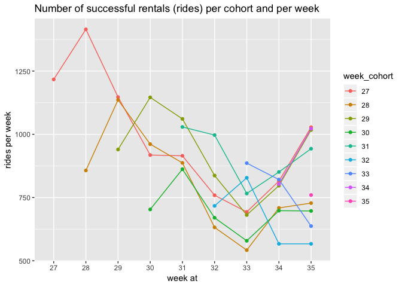

We see that the total number of rides made per cohort is decreasing
through the summer, however, it seems that it is not due to the
seniority of a cohort. For example, the cohort of the week 27, made
approximately the same number of ride in the week 34 than the cohort of
the week 30.

To calculate the weekly retention rates we will look at the proportion
of active users per week and per cohort. Instead of measuring the total
count of successful rides, as we did above, we will now consider the
ratio of users from a cohort who were active or not on each week.

    cohort.df <- na.omit(data.rentals) %>% 
      filter(rental_end_event == "close") %>%
      group_by(week_cohort,week_ride) %>%
      summarise(unique_users = n_distinct(user_id))

    cohort.df <- left_join(cohort.df,cohort.numUsers, by = "week_cohort")
    cohort.df <- cohort.df %>% mutate(perc_active_users = unique_users / num_users) %>%
      filter(week_ride < 36 & week_cohort < 36 & week_ride > 26)

    cohort.df2 <- cohort.df %>% mutate(perc_active_users100 = round(perc_active_users*100, 2)) %>%
      select(-num_users, -unique_users, -perc_active_users) %>%
      spread(week_cohort, perc_active_users100)

    cohort.df$week_cohort <- as.factor(cohort.df$week_cohort)
    cohort.df$week_ride <- as.factor(cohort.df$week_ride)

    knitr::kable(cohort.df2, caption = "Percentage active users per week per cohort")

<table>
<caption>Percentage active users per week per cohort</caption>
<thead>
<tr class="header">
<th align="right">week_ride</th>
<th align="right">26</th>
<th align="right">27</th>
<th align="right">28</th>
<th align="right">29</th>
<th align="right">30</th>
<th align="right">31</th>
<th align="right">32</th>
<th align="right">33</th>
<th align="right">34</th>
<th align="right">35</th>
</tr>
</thead>
<tbody>
<tr class="odd">
<td align="right">27</td>
<td align="right">42.0</td>
<td align="right">43.76</td>
<td align="right">NA</td>
<td align="right">NA</td>
<td align="right">NA</td>
<td align="right">NA</td>
<td align="right">NA</td>
<td align="right">NA</td>
<td align="right">NA</td>
<td align="right">NA</td>
</tr>
<tr class="even">
<td align="right">28</td>
<td align="right">29.0</td>
<td align="right">42.71</td>
<td align="right">41.55</td>
<td align="right">NA</td>
<td align="right">NA</td>
<td align="right">NA</td>
<td align="right">NA</td>
<td align="right">NA</td>
<td align="right">NA</td>
<td align="right">NA</td>
</tr>
<tr class="odd">
<td align="right">29</td>
<td align="right">23.5</td>
<td align="right">34.26</td>
<td align="right">39.23</td>
<td align="right">42.91</td>
<td align="right">NA</td>
<td align="right">NA</td>
<td align="right">NA</td>
<td align="right">NA</td>
<td align="right">NA</td>
<td align="right">NA</td>
</tr>
<tr class="even">
<td align="right">30</td>
<td align="right">28.0</td>
<td align="right">29.27</td>
<td align="right">34.25</td>
<td align="right">44.39</td>
<td align="right">44.10</td>
<td align="right">NA</td>
<td align="right">NA</td>
<td align="right">NA</td>
<td align="right">NA</td>
<td align="right">NA</td>
</tr>
<tr class="odd">
<td align="right">31</td>
<td align="right">23.0</td>
<td align="right">26.10</td>
<td align="right">28.51</td>
<td align="right">35.39</td>
<td align="right">38.57</td>
<td align="right">51.77</td>
<td align="right">NA</td>
<td align="right">NA</td>
<td align="right">NA</td>
<td align="right">NA</td>
</tr>
<tr class="even">
<td align="right">32</td>
<td align="right">14.0</td>
<td align="right">20.15</td>
<td align="right">20.55</td>
<td align="right">24.41</td>
<td align="right">27.95</td>
<td align="right">42.27</td>
<td align="right">55.0</td>
<td align="right">NA</td>
<td align="right">NA</td>
<td align="right">NA</td>
</tr>
<tr class="odd">
<td align="right">33</td>
<td align="right">15.0</td>
<td align="right">17.27</td>
<td align="right">18.12</td>
<td align="right">22.69</td>
<td align="right">24.22</td>
<td align="right">32.91</td>
<td align="right">46.6</td>
<td align="right">60.78</td>
<td align="right">NA</td>
<td align="right">NA</td>
</tr>
<tr class="even">
<td align="right">34</td>
<td align="right">20.5</td>
<td align="right">21.21</td>
<td align="right">21.88</td>
<td align="right">27.99</td>
<td align="right">27.35</td>
<td align="right">32.48</td>
<td align="right">35.2</td>
<td align="right">46.80</td>
<td align="right">64.27</td>
<td align="right">NA</td>
</tr>
<tr class="odd">
<td align="right">35</td>
<td align="right">23.5</td>
<td align="right">27.35</td>
<td align="right">24.53</td>
<td align="right">31.94</td>
<td align="right">29.75</td>
<td align="right">34.89</td>
<td align="right">35.4</td>
<td align="right">39.22</td>
<td align="right">55.56</td>
<td align="right">73.73</td>
</tr>
</tbody>
</table>

let's plot those data:

    p <- cohort.df %>%
      ggplot(aes(x = week_ride, y = perc_active_users, group = week_cohort)) +
          geom_line(aes(colour = week_cohort)) + geom_point(aes(colour = week_cohort)) +
          ylab("active users [%]") + xlab("week at") +
          ggtitle("Percentage of active users per week and per cohort")
    print(p)

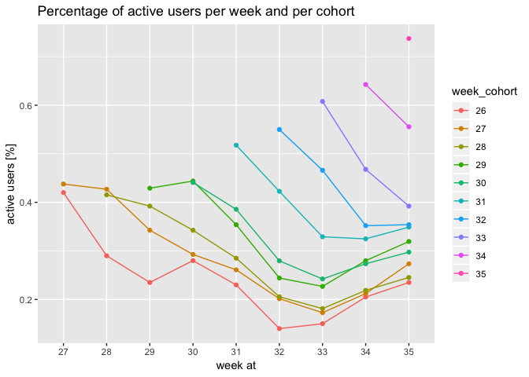

Interestingly, through the summer, the number of new customers per week
has decreased, however, those users seem to have a better retention
rate. We see a strong improvement of the amount of new users who
successfully used the Coup app within the same week they've installed
it. It might be an improvement in the time needed to install the app, we
will check this in [Duration/Signup](#signup).

Let's plot our data but organized by weeks since signup instead:

    cohort.df <- na.omit(data.rentals) %>% 
      filter(rental_end_event == "close") %>%
      group_by(week_cohort,week_ride) %>%
      summarise(unique_users = n_distinct(user_id))

    cohort.df <- left_join(cohort.df,cohort.numUsers, by = "week_cohort")
    cohort.df <- cohort.df %>% mutate(perc_active_users = unique_users / num_users,
                                      week_since = week_ride - week_cohort) %>%
      filter(week_ride < 36 & week_cohort < 36 & week_ride > 26)

    cohort.df$week_cohort <- as.factor(cohort.df$week_cohort)
    cohort.df$week_since <- as.factor(cohort.df$week_since)

    p <- cohort.df %>%
      ggplot(aes(x = week_since, y = perc_active_users, group = week_cohort)) +
          geom_line(aes(colour = week_cohort)) + geom_point(aes(colour = week_cohort)) +
          ylab("active users [%]") + xlab("week since signup") +
          ggtitle("Percentage of active users per week since signup and per cohort")
    print(p)

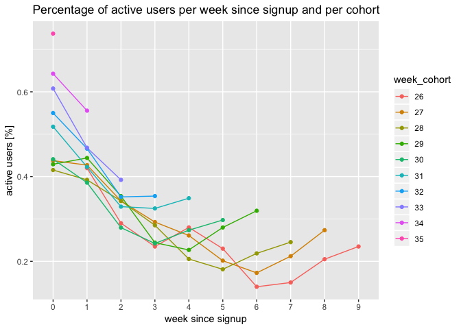

    cohort.percUseWeekSince <- cohort.df %>% group_by(week_since) %>%
      summarize(mean = mean(perc_active_users), sd  = sd(perc_active_users))

    knitr::kable(cohort.percUseWeekSince, caption = "Percentage of active users per week since install (mean and standard deviation between cohorts")

<table>
<caption>Percentage of active users per week since install (mean and standard deviation between cohorts</caption>
<thead>
<tr class="header">
<th align="left">week_since</th>
<th align="right">mean</th>
<th align="right">sd</th>
</tr>
</thead>
<tbody>
<tr class="odd">
<td align="left">0</td>
<td align="right">0.5309661</td>
<td align="right">0.1129414</td>
</tr>
<tr class="even">
<td align="left">1</td>
<td align="right">0.4423430</td>
<td align="right">0.0510833</td>
</tr>
<tr class="odd">
<td align="left">2</td>
<td align="right">0.3352336</td>
<td align="right">0.0362008</td>
</tr>
<tr class="even">
<td align="left">3</td>
<td align="right">0.2825582</td>
<td align="right">0.0454050</td>
</tr>
<tr class="odd">
<td align="left">4</td>
<td align="right">0.2659867</td>
<td align="right">0.0496861</td>
</tr>
<tr class="even">
<td align="left">5</td>
<td align="right">0.2380222</td>
<td align="right">0.0497725</td>
</tr>
<tr class="odd">
<td align="left">6</td>
<td align="right">0.2127220</td>
<td align="right">0.0780915</td>
</tr>
<tr class="even">
<td align="left">7</td>
<td align="right">0.2024653</td>
<td align="right">0.0483758</td>
</tr>
<tr class="odd">
<td align="left">8</td>
<td align="right">0.2392562</td>
<td align="right">0.0484456</td>
</tr>
<tr class="even">
<td align="left">9</td>
<td align="right">0.2350000</td>
<td align="right">NA</td>
</tr>
</tbody>
</table>

We see that we have a loss of users over time. We had an average of 44%
of users who made a successful rental the 1st week after
their signup, but less than 30% past three weeks after the signup. We
observed an increase after few weeks, however this is probably due to
the time of measurement that spans over the summer, it appears natural
that a lot of users might have left the city over the Summer and are
returning by the end of August.

The information we have gathered through the cohort analysis is
valuable, especially for the marketing team as we saw a decrease in the
number of new customers through the summer but an increase in their
quality (as measured by the returning rate of those users).

Durations
===============================

Signup
-------------------------

We will now explore the duration of the signup process. To signup to
Coup, one has to upload their documents (passport, driving license)
which are normally automatically scan and validated. Once the user
information has been validated, the signup is completed. Looking at the
reviews let online by users, it appears that the signup process is a
source of issues for many users.

    duration.signup <- data.users %>%
      select(signup_started, signup_completed) %>%
      mutate(signup_duration = as.numeric(signup_completed - signup_started) / 60)

    summary(duration.signup$signup_duration)

    ##      Min.   1st Qu.    Median      Mean   3rd Qu.      Max. 
    ##   -1.5422    0.2454    1.8344   57.6763   29.3326 1529.9922

    p <- duration.signup %>% mutate(signup_lim = replace(signup_duration, signup_duration > 24, 24)) %>%
      ggplot(aes(x = as.numeric(signup_lim))) +
          geom_histogram(binwidth = 1) + xlab("hours") +
          ggtitle("Distribution of signup duration time in hours")
    print(p)

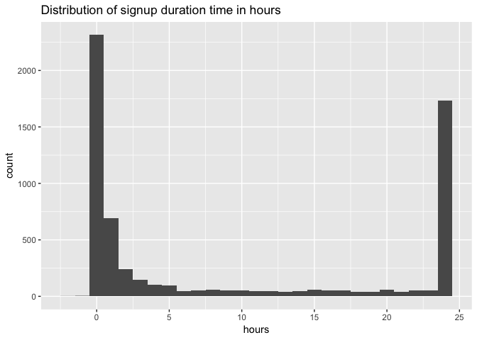

We see here the signup duration process in hours. On the plot above we
have aggregated all signup processes who took more than 24 hours. We can
see that 2316 out of 6227 users (37%) were able to complete the signup
process within an hour. The median time is 1h50min, however the
3rd quartile (75% of users) is at 29h20min (as seen with the
higher number of cases where the signup process took more than 24h). The
longer signup duration is at 1530h, around two months. All together, we
have:

    qtl <- c(.01, .05, .1, .2, .3, .4, .5, .6, .7, .8, .9, .95, .99)
    res = quantile(as.duration(duration.signup$signup_duration*60*60), qtl)
    knitr::kable(res, caption = "duration of the signup process per percentiles")

<table>
<caption>duration of the signup process per percentiles</caption>
<thead>
<tr class="header">
<th></th>
<th align="right">x</th>
</tr>
</thead>
<tbody>
<tr class="odd">
<td>1%</td>
<td align="right">415s (~6.92 minutes)</td>
</tr>
<tr class="even">
<td>5%</td>
<td align="right">496.3s (~8.27 minutes)</td>
</tr>
<tr class="odd">
<td>10%</td>
<td align="right">571s (~9.52 minutes)</td>
</tr>
<tr class="even">
<td>20%</td>
<td align="right">733s (~12.22 minutes)</td>
</tr>
<tr class="odd">
<td>30%</td>
<td align="right">1146s (~19.1 minutes)</td>
</tr>
<tr class="even">
<td>40%</td>
<td align="right">2208.8s (~36.81 minutes)</td>
</tr>
<tr class="odd">
<td>50%</td>
<td align="right">6604s (~1.83 hours)</td>
</tr>
<tr class="even">
<td>60%</td>
<td align="right">29198s (~8.11 hours)</td>
</tr>
<tr class="odd">
<td>70%</td>
<td align="right">74784.3999999999s (~20.77 hours)</td>
</tr>
<tr class="even">
<td>80%</td>
<td align="right">176371.2s (~2.04 days)</td>
</tr>
<tr class="odd">
<td>90%</td>
<td align="right">590222s (~6.83 days)</td>
</tr>
<tr class="even">
<td>95%</td>
<td align="right">1124196.5s (~1.86 weeks)</td>
</tr>
<tr class="odd">
<td>99%</td>
<td align="right">3106169.5s (~5.14 weeks)</td>
</tr>
</tbody>
</table>

From this table we see that 1% of our users took less than ~7min to
signup, that 10% of our users took less than ~10min, that 20% took less
than ~12min... that 99% took less than 5 weeks. However we see that
still 20% took more than ~2days and 10% took more than a week. We have a
non-negligible part of our users who took an abnormally long time to
finish the sign-up process.

We also see that we have some cases where the signup process took a
negative time:

    knitr::kable(duration.signup[duration.signup$signup_duration<0, ], caption = "Negative signup duration")

<table>
<caption>Negative signup duration</caption>
<thead>
<tr class="header">
<th align="left">signup_started</th>
<th align="left">signup_completed</th>
<th align="right">signup_duration</th>
</tr>
</thead>
<tbody>
<tr class="odd">
<td align="left">2018-07-25 23:41:16</td>
<td align="left">2018-07-25 23:37:55</td>
<td align="right">-0.0558333</td>
</tr>
<tr class="even">
<td align="left">2018-07-26 08:56:08</td>
<td align="left">2018-07-26 08:06:22</td>
<td align="right">-0.8294444</td>
</tr>
<tr class="odd">
<td align="left">2018-07-26 14:02:53</td>
<td align="left">2018-07-26 12:46:11</td>
<td align="right">-1.2783333</td>
</tr>
<tr class="even">
<td align="left">2018-07-26 17:14:36</td>
<td align="left">2018-07-26 16:12:33</td>
<td align="right">-1.0341667</td>
</tr>
<tr class="odd">
<td align="left">2018-07-26 17:35:53</td>
<td align="left">2018-07-26 16:03:21</td>
<td align="right">-1.5422222</td>
</tr>
</tbody>
</table>

It might be a problem in the way the time is measured, maybe recording
UTC time from the app for the `signup_completed` and recording local
time from the user for `signup_started`.

In the [cohort analysis](#cohort) section we saw that the later cohort
had more successful rental the week they've signup. It might be an
indication that the signup process had been improved over the course of
the summer. Let's check it:

    duration.cohort <- duration.signup %>% mutate(week_cohort = isoweek(signup_started)) %>%
      filter(week_cohort < 36) %>%
      group_by(week_cohort) %>%
      summarise(med_duration = median(signup_duration))

    duration.cohort$week_cohort <- as.factor(duration.cohort$week_cohort)

    p <- duration.cohort %>%
      ggplot(aes(x = as.factor(week_cohort), y = med_duration, fill = as.factor(week_cohort))) +
          geom_bar(stat = "identity") +
          ylab("signup duration [hours]") + xlab("week cohort") +
          ggtitle("Median duration (in hours) of signup per cohort") +
          guides(fill=FALSE)
    print(p)

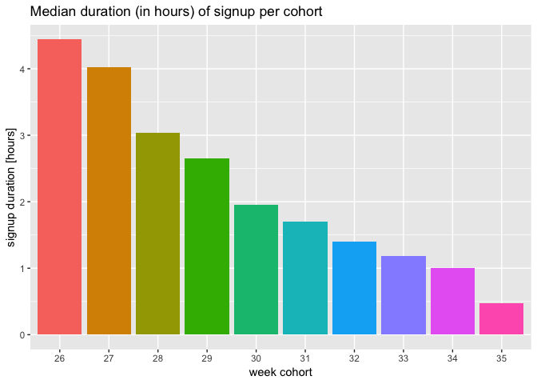

We see a strong decrease over the course of the summer of the median
time for signup process. We should also take into consideration that we
only have the data of users who did completed the signup process. We
have, especially for the last cohorts, many users who have started the
signup process but haven't completed it yet and their data isn't
available. However, it seems unlikely that this process alone would
explain the observed decrease, and, together with the observation made
in the cohort analysis, we can safely confirm that the signup process
has greatly improved over the course of the summer.

Rental
-------------------------

We will now explore the rentals data and determine the expiry time of a
rental.

For that task we will calculate the time duration of rentals for which
the end event `rental_end_event` was set to `expire`.

    duration.rentalExp <- data.rentals %>%
      filter(rental_end_event == "expire") %>%
      mutate(rental_duration = as.numeric(rental_ended_at - rental_created_at)*60) %>%
      select(rental_duration)

    knitr::kable(quantile(duration.rentalExp$rental_duration, c(0, .001, .01, .05, .99, .999, 1)),
                 caption = "quantiles of rental duration before expiration in seconds")

<table>
<caption>quantiles of rental duration before expiration in seconds</caption>
<thead>
<tr class="header">
<th></th>
<th align="right">x</th>
</tr>
</thead>
<tbody>
<tr class="odd">
<td>0%</td>
<td align="right">115.000</td>
</tr>
<tr class="even">
<td>0.1%</td>
<td align="right">900.000</td>
</tr>
<tr class="odd">
<td>1%</td>
<td align="right">900.000</td>
</tr>
<tr class="even">
<td>5%</td>
<td align="right">901.000</td>
</tr>
<tr class="odd">
<td>99%</td>
<td align="right">979.000</td>
</tr>
<tr class="even">
<td>99.9%</td>
<td align="right">5333.716</td>
</tr>
<tr class="odd">
<td>100%</td>
<td align="right">16091.000</td>
</tr>
</tbody>
</table>

We see that the shortest rental who expired lasted 115 seconds. However
the 0.1% and 1% percentiles show a value of 900 seconds (exactly 15min).
The longest rental who expired took 16091 seconds (around 4h30min). We
saw in the previous tasks that the time isn't always properly measured
(as shown by negative time for user registration), so we should take
with care the value of 115 seconds as the shortest expiration time. It
seems that a rental will normally expire after exactly 15min.

Temperature effect on Rides
=================================================

Now that we understand the data better we will look at external causes
that can impact the number of successful rental. We will look at hourly
data:

    hourly.rentals <- data.rentals %>% filter(rental_end_event == "close") %>%
      mutate(date = floor_date(rental_created_at, "hour")) %>%
      group_by(date) %>%
      summarise(num = n())

    hourly.temper <- data.temper %>%
      mutate(date = floor_date(observation_time, "hour")) %>%
      group_by(date) %>%
      summarise(degC = mean(temp_c))

    hourly.data <- left_join(hourly.rentals, hourly.temper, by = "date")

    hourly.data <- na.omit(hourly.data)
    hourly.data$num <- as.numeric(hourly.data$num)
    corr <- cor(x = hourly.data$num, y = hourly.data$degC)

    p <- hourly.data %>%
      ggplot(aes(x = num, y = degC)) +
          geom_point(color = "blue", alpha = 0.5, size = 2) +
          geom_smooth(method = "glm", color = "black") +
          xlab("hourly rides count") + ylab("hourly temperature in degC") +
          ggtitle("Scatterplot of hourly temperature and rentals + linear regression")
    print(p)

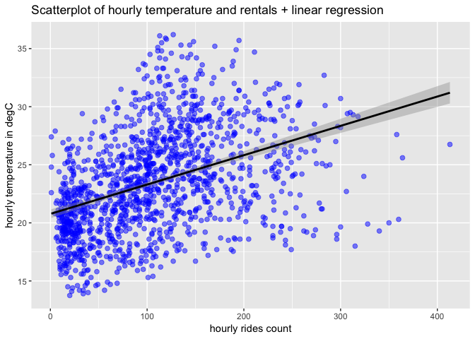

    print(paste0("correlation R = ",round(corr,2)))

    ## [1] "correlation R = 0.41"

Hourly rentals and temperatures show a positive correlation (R = 0.41).
It could, however, be the results of night time where temperature are
lower and fewer users use Coop.

We will now look at the relationship between temperature and rental on a
daily basis, looking at maximum daily temperature and total daily
rentals.

    daily.data <- hourly.data %>%
      mutate(day = floor_date(date, "day")) %>%
      group_by(day) %>%
      summarise(num = sum(num), maxDegC = max(degC))

    p <- daily.data %>%
      ggplot(aes(x = day, y = maxDegC)) +
          geom_bar(stat = "identity", alpha = 0.35, fill = "blue") +
          geom_line(aes(x = day, y = num/100), colour = "black") +
          scale_y_continuous(sec.axis = sec_axis(~.*100, name = "daily rentals")) +
          coord_cartesian(ylim=c(10, 40)) +
          ylab("max daily temperature [degC]") +
          ggtitle("Time Series of daily max temperature (barplot) and rentals (line)")
    print(p)

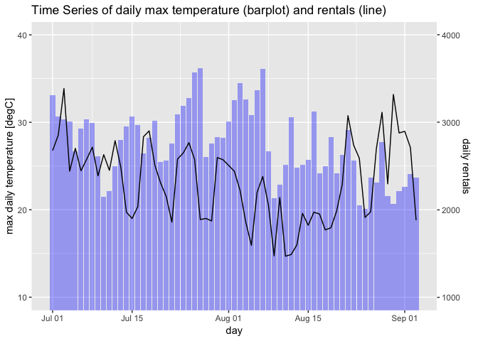

    corr <- cor(x = daily.data$num, y = daily.data$maxDegC)

    p <- daily.data %>%
      ggplot(aes(x = num, y = maxDegC)) +
          geom_point(color = "blue", alpha = 0.5, size = 2) +
          geom_smooth(method = "glm", color = "black") +
          xlab("daily rides [count]") + ylab("daily maximum temperature [degC]") +
          ggtitle("Scatterplot of daily temperature and rentals + linear regression")
    print(p)

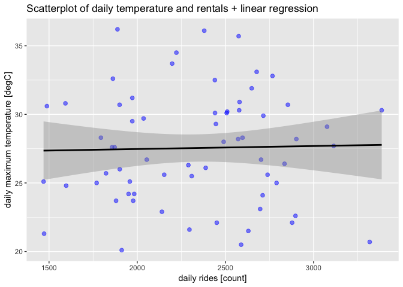

    print(paste0("correlation R = ",round(corr,2)))

    ## [1] "correlation R = 0.02"

It appears that maximum daily temperature and daily rentals aren't
correlated. From the time series plot it seems that events of hot waves
at the end of July and beginning of August might had a negative impact
on the rentals. This later analysis tend to confirm that the apparent
correlation between temperature and rentals on an hourly basis was the
result of the time within the day acting as a confusion factor.

Rentals seem to be more strongly affected by the time within the day as
well as the day of the week.

    dayhour.data <- hourly.data %>%
      mutate(hour = hour(date)) %>%
      group_by(hour) %>%
      summarize(mean = mean(num), sd = sd(num))

    p <- dayhour.data %>%
      ggplot(aes(x = as.factor(hour), y = mean)) +
          geom_bar(stat = "identity", fill = "red", alpha = 0.35) +
          geom_errorbar(aes(ymin=mean-sd, ymax=mean+sd), colour="black") +
          xlab("hour of the day") + ylab("mean rentals") +
          ggtitle("Average rentals per hour of the day")
    print(p)

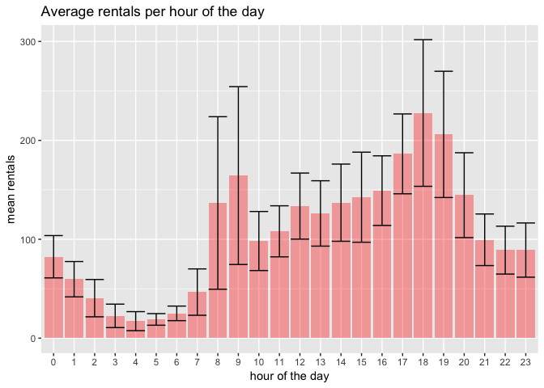

From this graph we see a clear effect of the time of the day. We have
the maximum rentals between 8am and 8pm, with a morning peak from 8 to
9am and a late afternoon peak from 5pm to 7pm. The lowest rentals happen
from 3 to 6am.

Let's quickly look at the impact of the week day:

    weekday.data <- hourly.data %>%
      mutate(day = wday(date, label = T, abbr = T)) %>%
      group_by(day) %>%
      summarize(mean = mean(num), sd = sd(num))

    p <- weekday.data %>%
      ggplot(aes(x = day, y = mean)) +
          geom_bar(stat = "identity", fill = "red", alpha = 0.35) +
          geom_errorbar(aes(ymin=mean-sd, ymax=mean+sd), colour="black") +
          xlab("day of the week") + ylab("mean rentals") +
          ggtitle("Average rentals per day of the week")
    print(p)

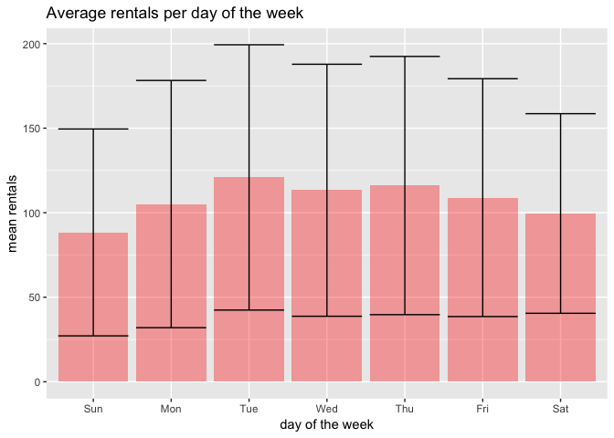

The day of the week effect on rentals isn't as strong as the time within
the day. It seems that we have slightly less rentals on Sundays. We
have, however, a strong variance as shown by the error bars.

From the data we have, it seems that the time within a day is the most
important factor affecting the number of rentals. The daily temperatures
aren't correlated to the number of rentals, yet, we have data that cover
July and August where the maximum daily temperature was never lower than
20oC. We could have potentially observed an effect of the
extreme temperatures (more than 35oC during the day) on the
rentals, yet, it is unclear. A more relevant feature to account for the
weather impact on rentals would be to collect precipitations data.
